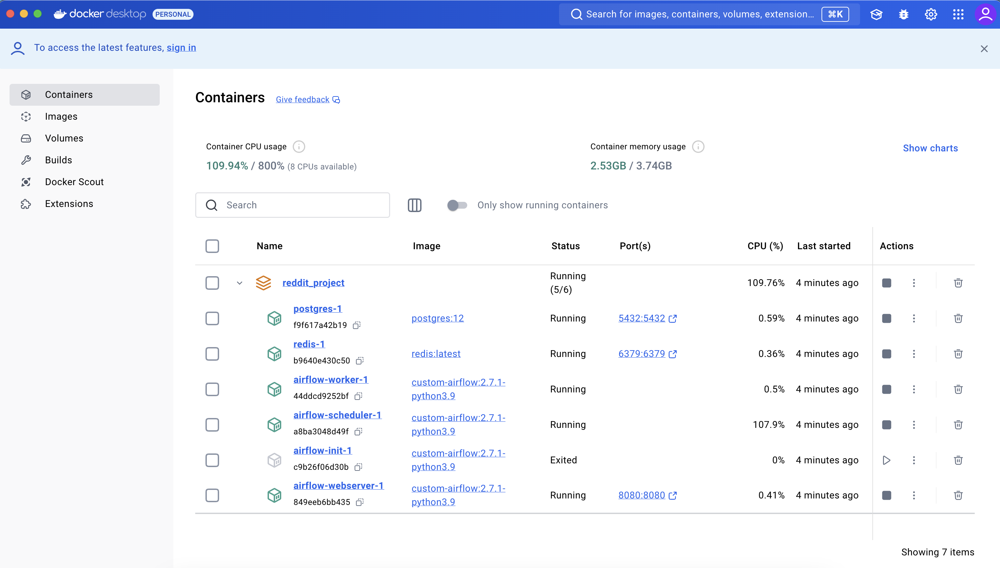
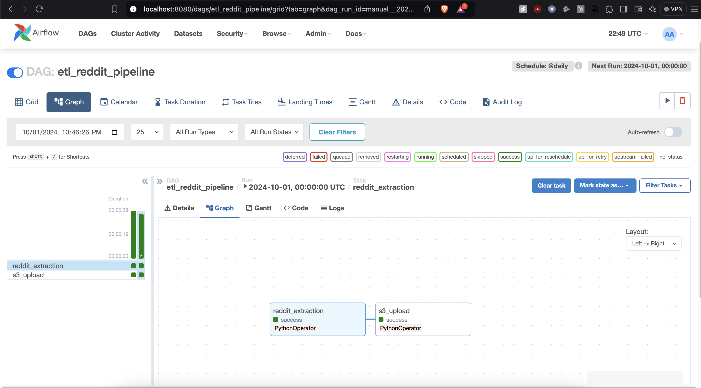
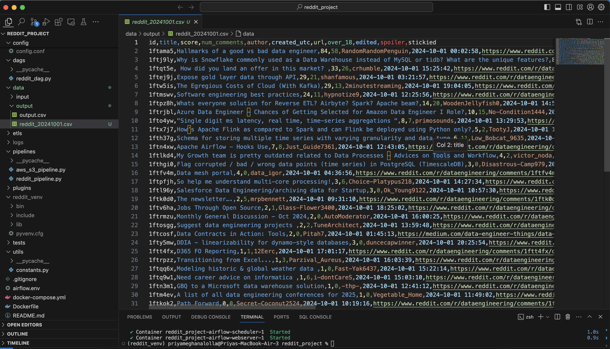
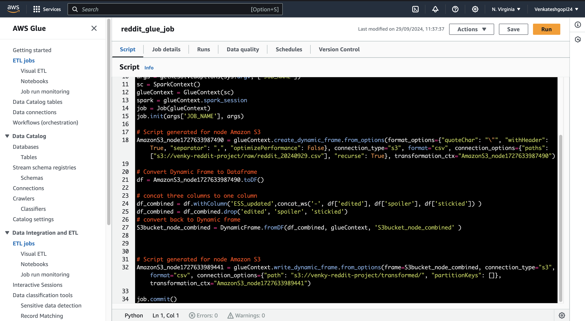
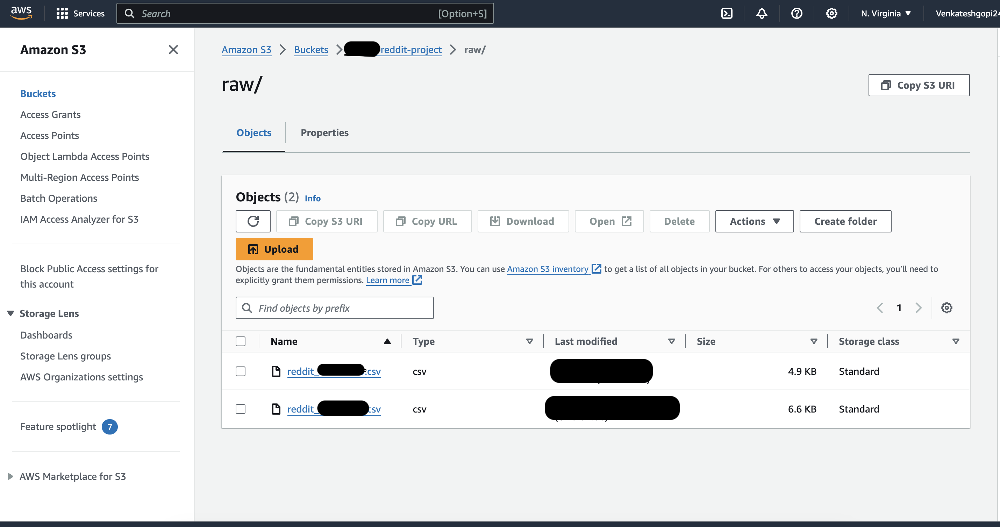
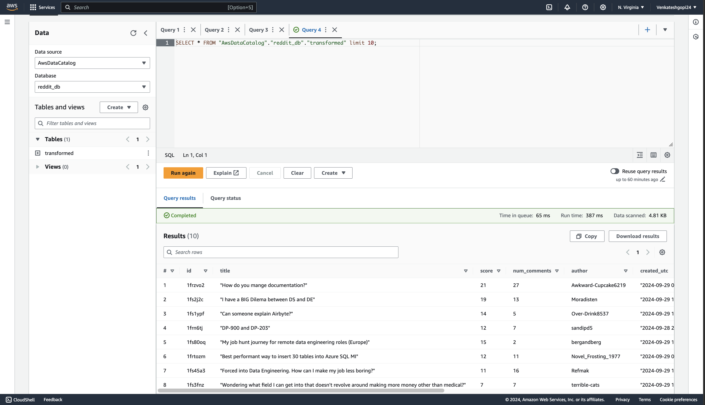

# Reddit Data Pipeline Engineering with Apache Airflow and AWS

This project demonstrates a complete data engineering pipeline that extracts data from Reddit, processes it, and loads it into AWS services (Redshift and Glue Database) for further transformations and visualization. The pipeline is orchestrated using **Apache Airflow** and leverages **AWS S3**, **AWS Glue**, **AWS Glue Crawler**, **AWS Athena**, and **Amazon Redshift** for efficient data handling.

## Table of Contents
- [Overview](#overview)
- [Features](#features)
- [Technologies Used](#technologies-used)
- [Setup Instructions](#setup-instructions)
- [Project Workflow](#project-workflow)
- [Screenshots](#screenshots)
- [Conclusion](#conclusion)

## Overview

This project connects to a Reddit instance using Apache Airflow to manage ETL (Extract, Transform, Load) tasks, integrating with various AWS services to extract, clean, transform, and visualize Reddit data. The pipeline includes:

- Extracting posts from a specified subreddit using Reddit's API.
- Cleaning and transforming the data into a structured format.
- Uploading the data to an S3 bucket for storage.
- Utilizing AWS Glue to further process and transform the data.
- Querying the transformed data using AWS Athena and querying it through SQL.
- Loading the data into Amazon Redshift for advanced analytics.

## Features
- **Data Extraction**: Retrieves posts from Reddit using the PRAW library.
- **Data Transformation**: Cleans and structures the data using Pandas.
- **Cloud Integration**: Utilizes AWS S3 for storage, AWS Glue for data transformation, AWS Athena for querying, and Amazon Redshift for advanced data analytics.
- **Orchestration**: Manages the pipeline with Apache Airflow and Celery backend using Docker.

## Technologies Used

- **PRAW**: Python Reddit API Wrapper used for extracting data from Reddit.
- **Pandas**: For data manipulation and transformation.
- **Docker**: Containerization platform for running Airflow, PostgreSQL, and Redis services.
- **PostgreSQL**: Used as the metadata backend for Airflow.
- **Redis**: Used as the message broker for Celery in Airflow.
- **AWS S3**: For storing extracted data in CSV format.
- **AWS Glue**: For data transformation and schema management through crawlers and ETL jobs.
- **AWS Athena**: For querying data stored in S3 using SQL.
- **Amazon Redshift**: For advanced analytics and data warehousing capabilities.
- **Apache Airflow's Celery Executor**: For distributing tasks across multiple worker nodes, improving scalability.
- **AWS IAM (Identity and Access Management)**: For managing permissions and access to AWS resources securely.
- **AWS CloudFormation**: For automating the deployment of AWS infrastructure.
- **AWS SDK for Python (Boto3)**: For programmatic interaction with AWS services.
- **Git**: For version control and collaboration.

## Setup Instructions

1. **Clone the repository**:
   ```bash
   git clone https://github.com/venkateshgopinath24/Reddit_data_pipeline.git
   cd reddit_data_pipeline
   ```

2. **Install dependencies**:
   Prepare necessary directories and files:
   ```bash
   mkdir config dags data etls logs pipelines tests utils
   touch airflow.env docker-compose.yml Dockerfile
   ```
   Using a Python virtual environment (3.9 recommended), install dependencies:
   ```bash
   pip install apache-airflow numpy pandas praw
   ```
   Ensure you have Docker installed. Create `requirements.txt` to be used by Docker to create a container with necessary dependencies:
   ```bash
   pip freeze > requirements.txt
   ```

3. **Create a Reddit application**:
   - Go to [Reddit's Developer Portal](https://www.reddit.com/prefs/apps) and create a new application.
   - Set the `client_id`, `client_secret`, and `user_agent` in your configuration file.

4. **Configure environment variables in `.config`**:
   ```bash
   [database]
   database_host = localhost
   database_name = airflow_reddit
   database_port = 5432
   database_username = postgres
   database_password = postgres

   [file_paths]
   input_path = /opt/airflow/data/input
   output_path = /opt/airflow/data/output

   [api_keys]
   reddit_secret_key = ["your_reddit_client_secret"]
   reddit_client_id = ["your_reddit_client_id"]

   [aws]
   aws_access_key_id = ["your_aws_access_key"]
   aws_secret_access_key= ["your_aws_secret_key"]
   aws_session_token= ["aws_session_token"]
   aws_region = ["your_aws_region"]
   aws_bucket_name = ["your_aws_bucket_name"] 
   
   [etl_settings]
   batch_size = 100
   error_handling = abort
   log_level = info
   ```

5. **Run the Docker containers**:
   ```bash
   docker compose up -d --build
   ```
   - Docker view.
   
   


6. **Trigger the DAG**:
   Access Airflow via `localhost:8080` and trigger the DAG for Reddit data extraction and transformation.

## Project Workflow

1. **Reddit Data Extraction**:
   - The pipeline connects to Reddit using the PRAW library and extracts posts from a specified subreddit.
   
   

   - Below is an example of raw data.
   

2. **Data Transformation**:
   - The extracted data is cleaned and transformed using Pandas to create a structured DataFrame.

   

3. **Data Storage**:
   - The cleaned data is uploaded to an AWS S3 bucket as CSV files.

   

4. **AWS Glue for ETL**:
   - AWS Glue crawls the data in S3 to generate a schema and further transforms the data.

5. **Querying with AWS Athena**:
   - SQL queries are executed on the cleansed data in AWS Athena for insights and visualization.

   

6. **Loading Data into Amazon Redshift**:
   - Finally, the transformed data is loaded into Amazon Redshift for further analysis and reporting.

## Conclusion

This project demonstrates the end-to-end process of building a scalable data pipeline using Apache Airflow to extract data from Reddit, followed by the transformation and visualization of the data using AWS services such as S3, Glue, Athena, and Redshift. By integrating these cloud technologies, the pipeline automates the entire ETL workflow, allowing for efficient data handling and advanced analytics.

The use of Apache Airflow ensures that the tasks are properly orchestrated, monitored, and scheduled. AWS services enhance the storage, transformation, and querying capabilities, providing a powerful platform for managing large-scale data pipelines. This project serves as a practical example of how open-source and cloud tools can be combined to build a robust, cloud-native data engineering solution.
